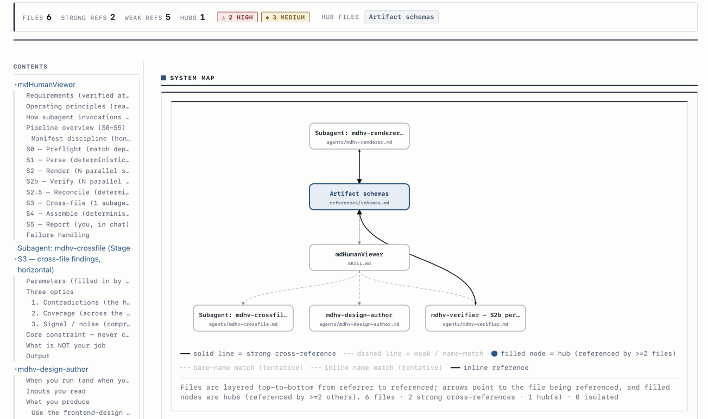

<div align="center">

<h1>mdHumanViewer</h1>

<p>
  <strong>Turn a folder of related Markdown into one self-contained, human-readable HTML overview.</strong><br/>
  A <em>view, not storage</em> — it never touches your source <code>.md</code> and regenerates on demand.
</p>

<p>
  <a href="LICENSE"></a>
  <a href="https://github.com/werkodev/mdhumanviewer/releases"></a>
  <a href="https://github.com/werkodev/mdhumanviewer/actions/workflows/ci.yml"></a>
  <a href="#install"></a>
</p>

<p>
  <a href="#install"><b>Install</b></a> ·
  <a href="#what-it-does"><b>What it does</b></a> ·
  <a href="#usage"><b>Usage</b></a> ·
  <a href="#how-it-works"><b>How it works</b></a> ·
  <a href="SKILL.md"><b>Architecture</b></a>
</p>



</div>

> [!TIP]
> **Quickstart** — `/plugin marketplace add werkodev/mdhumanviewer`, then `/plugin install mdhumanviewer@mdhumanviewer`, and ask Claude for _"an overview of `./your-markdown-dir`"_.

## What it does

Point mdHumanViewer at a directory of related Markdown files — skills, specs, RCA notes, "machine text for machines" — and it assembles a single, self-contained `overview.html` that lets a human understand the corpus **as a system**:

- **One page, no network.** Everything (CSS, JS, content) is inlined into one HTML file you open locally.
- **Structure-faithful.** The page mirrors the original heading structure; raw prose stays in the `.md` and is one click away from every section.
- **Cross-file links.** A dependency graph connects files that reference each other — by `[text](file.md)` link _or_ by backtick filename (`` `SKILL.md` ``) — with strong/weak edges, rendered as a chip strip (tiny/edgeless corpora) or a layered flow diagram whose depth follows how deeply the corpus is connected.
- **Contradiction findings.** A cross-file pass surfaces contradictions, coverage gaps, and signal/noise observations near the top, severity-tagged.
- **Contract checks.** Cross-cutting "contracts" (the load-bearing claims in your docs) are extracted per file and verified against the source bytes at assembly time.

**Read-once, fully parallel, deterministic assembly:**

- Each source file enters an LLM context **exactly twice** — once to render, once to verify — and never again.
- Both per-file passes **fan out N agents in a single turn**, so the cost is **max-of-files, not sum-of-files**.
- Discovery, structure, the dependency graph, page assembly, and all four fidelity gates run in **pure stdlib Python off the LLM hot path** — **zero serial whole-corpus generation passes**.

## Why — view, not storage

Markdown is the substrate you `grep` and edit (the **grep lane**). HTML is the view layer assembled for human perception (the **render lane**). The two lanes never fight:

- The source `.md` files are **never modified**.
- The HTML is **regenerated on demand** from the current state of the sources.
- The intermediate artifacts are **disposable** — only the current `overview.html` matters.

Nothing in the render lane is authoritative, and nothing in it is ever written back into the grep lane. You read the overview to understand the whole; you open a source file only when you need the raw detail.

## Requirements

> [!IMPORTANT]
> mdHumanViewer needs the **`frontend-design`** skill installed and enabled — it's a hard dependency. S0 Preflight stops early with a message if it's missing.

| Requirement | Why |
|---|---|
| **`frontend-design` skill** (installed + enabled) | Used **once** — via the `mdhv-design-author` agent — to author (or `--reskin`) the committed design system `references/design-system.html`. The per-file render agents do **not** call it; they emit semantic HTML against the already-committed class vocabulary. |
| **Python 3.9+** on `PATH` | The deterministic scripts (`parse_structure.py`, `init_session.py`, `reconcile.py`, `assemble.py`, …) are stdlib-only and use PEP 585 builtin generics (`dict[str, int]`), which require 3.9. |
| **Claude Code with root-level `SKILL.md` support** | This plugin ships its skill as a root-level single-skill `SKILL.md`; it is only auto-detected on runtimes that support that layout. The pipeline also relies on parallel subagents. |

## Install

### Via marketplace (recommended)

This repo ships a `.claude-plugin/marketplace.json`, so you can add it as a marketplace and install from it:

```
/plugin marketplace add werkodev/mdhumanviewer
/plugin install mdhumanviewer@mdhumanviewer
```

`add` takes the GitHub `owner/repo` shorthand (`werkodev/mdhumanviewer`). `mdhumanviewer@mdhumanviewer` is `<plugin-name>@<marketplace-name>`: the plugin `name` in `plugin.json` and the marketplace `name` in `marketplace.json` are both `mdhumanviewer` — a single-plugin catalog named after its plugin. The publishing GitHub account is `werkodev` (the marketplace `owner`).

### Manually

Clone or copy the plugin into a directory of your choice, then point Claude Code at it for the session:

```
claude --plugin-dir ./mdhumanviewer
```

Once loaded, the skill registers as `/mdhumanviewer:mdhumanviewer` (standard `/<plugin>:<skill>` namespacing). The four pipeline agents register as `mdhv-*` subagents (namespaced `mdhumanviewer:mdhv-*`) and are invoked by name while the skill is active.

## Usage

Point it at a directory of Markdown and ask for the big picture. A real example:

> Give me an overview of the Markdown in `./docs` — what's in there, how the files relate, and any contradictions.

The pipeline is **interactive at S1**: after deterministic discovery, you are shown the files grouped by directory with token estimates and asked which to include — a directory, individual files (by slug or path), a glob (`skills/*`), or `all`. The automated stages run only after you confirm the selection (the selection defines the system boundary the overview describes).

**Usage patterns:**

| Pattern | Ask for… | What you get |
|---|---|---|
| **Overview / onboarding** | "the big picture of `./references`" | A system map: groups, structure, the dependency graph, and a per-file digest you can skim top-down. |
| **Audit / contradictions** | "contradictions between these specs" | Cross-file findings up front — high-severity contradictions and coverage gaps, with the files involved. |
| **Render-as-map** | "render my markdown as a readable HTML map" | A self-contained page where every section links back to its source `.md`, detail is collapsible, and cross-references are clickable. |

## How it works

`SKILL.md` orchestrates the S0–S5 pipeline (with an inserted S2.5 reconcile step). The orchestrator stays light — it holds only paths, the session dir, and step statuses; all heavy reading happens inside subagents and Python scripts whose results land on disk.

| Stage | What | How | Reads source | Output |
|---|---|---|---|---|
| **S0 Preflight** | match `frontend-design`; ensure design system; create session | skill + Python | 0 | session dir + `manifest.json` |
| **S1 Parse** | discover files, build heading/link structure + dependency graph | **Python, 0 LLM** | 0 | `structure.json` |
| **S2 Render** | per-file HTML fragment + analysis sidecar | **N parallel agents, 1 read each** | 1 | `fragments/<slug>.html`, `analysis/<slug>.json` |
| **S2b Verify** | re-read source, check fidelity, fix in place | **N parallel agents, 1 read each** | 1 | revised fragment + verdict |
| **S2.5 Reconcile** | losslessly close coverage + contract gates so assembly passes first try | **Python, 0 LLM** | 0 | fixed `fragments/` + `analysis/` in place |
| **S3 Cross-file** | contradictions / coverage / signal-noise | **1 agent, reads only `analysis/`** | 0 | `findings.json` |
| **S4 Assemble** | shell + zones + stitch fragments + 4 hard-fail gates | **Python, 0 LLM** | 0 | `overview.html` + JSON report |
| **S5 Report** | signpost in chat: where the file is and what to look at first | skill | 0 | chat message |

The single source of truth for the design-system class vocabulary lives in `scripts/constants.py` (19 required class hooks, 10 mount markers, 5 allowed chrome anchors). Assembly runs four hard-fail gates: **anchor resolution**, **per-file coverage**, **contract check**, and **no-runtime-fetch**.

For the full pipeline contract — manifest discipline, honest resume, the slug/anchor id space, and the artifact schemas — see [`SKILL.md`](./SKILL.md) and [`references/schemas.md`](./references/schemas.md). For local development (running the tests, contributor conventions), see [`CONTRIBUTING.md`](./CONTRIBUTING.md).

## Output layout

Each run lands in a fresh dated session directory under the analyzed root. Every run is a full regeneration; the intermediates are disposable.

```
<ROOT>/.mdHumanViewer/{yyyy-mm-dd_HH-MM}/
├── manifest.json          # selection + per-step status + resume semantics
├── structure.json         # whole-corpus skeleton + dependency graph (S1)
├── analysis/<slug>.json   # tldr + section kinds + contracts[] with source anchors (S2)
├── fragments/<slug>.html  # per-file HTML fragment (S2; edited in place by S2b)
├── findings.json          # cross-file findings (S3)
└── overview.html          # the deliverable — open it in a browser
```

**Only `overview.html` is the deliverable.** It is self-contained (no network needed): cross-file findings are surfaced near the top, second-level detail is collapsible, cross-references are clickable, and every section links back to its source `.md`. The rest are working artifacts that can be deleted afterward. The source `.md` files are never modified.

## Performance guarantee

- **About 2 LLM reads per file.** Each source enters an LLM context exactly twice — S2 (render) and S2b (verify) — and never again. S3 reads only the small `analysis/` sidecars; S1, S2.5, and S4 read no source into any LLM context at all.
- **Fully parallel.** Both per-file passes fan out N agents in a single assistant turn, so the cost is **max-of-files**, not sum-of-files.
- **Zero serial whole-corpus generation passes.** Nothing re-emits `O(total-content)` in a serial loop. Assembly is deterministic Python that stitches the already-rendered fragments.

## Design system and `--reskin`

The shared visual design — CSS, JS, mount markers, and the class vocabulary (`.mdhv-keypoints`, `.mdhv-contract`, `.mdhv-detail`, `.mdhv-src-link`, plus the graph / findings / TOC hooks) — is authored **once** via the `frontend-design` skill and **committed** to `references/design-system.html`.

Render agents emit **only semantic HTML using that agreed class vocabulary, with no inline `<style>`** — which is what guarantees visual consistency across N independently rendered fragments.

To change the look, **re-author the design once**: run the `mdhv-design-author` agent in `--reskin` mode to regenerate `references/design-system.html`. Nothing about the per-file render changes; the fragments are pure semantic HTML and inherit the new design automatically.

## Limitations / non-goals

- **It is a view, not a docs site generator.** It produces one self-contained overview page for human perception, not a multi-page navigable site, search index, or published documentation portal.
- **The `frontend-design` skill is required.** Without it, S0 Preflight stops early — there is no built-in fallback design author.
- **It costs LLM reads.** Roughly 2 reads per selected file (render + verify). Big selections cost proportionally more wall-clock per-agent, though the passes run in parallel.
- **The HTML is disposable.** It is never authoritative and never written back; if the sources change, regenerate.

## Troubleshooting

| Symptom | Cause / fix |
|---|---|
| Preflight stops before doing anything | The `frontend-design` skill isn't matched. Install/enable it (or confirm its exact namespaced name, e.g. `document-skills:frontend-design`) and re-run. |
| No `overview.html` was written | A hard-fail gate failed (anchor / coverage / contract / runtime-fetch). The assembler writes **no page** on failure and reports the offending slug(s). The pipeline does a bounded, targeted re-invoke; if it still fails it stops and reports verbatim. Re-run after addressing the named gap. |
| `SyntaxError` / generics error from a script | Python is older than 3.9. The scripts use PEP 585 builtin generics; install Python 3.9+. |

## Updating

Pull the latest plugin from the marketplace (the marketplace `name` from `marketplace.json`):

```
/plugin marketplace update mdhumanviewer
```

## Tests

The deterministic scripts are covered by stdlib tests (no `pytest`, no install step). From the repo root:

```
python3 -m unittest discover -s tests
```

They cover the parts users would notice if they broke: slug uniqueness on collisions, exclude defaults, heading-anchor de-duplication, strong/weak edge computation, the manifest skeleton, the graph-mode decision tree, the four assemble-time fidelity gates (anchor resolution, coverage, contract check, no-runtime-fetch), the design-system self-containment lint, and the error paths.

## License

[MIT](./LICENSE) © 2026 werkodev.

## Origin

mdHumanViewer began as a manifesto — the [`mdHumanViewer.md`](https://gist.github.com/werkodev/00c551010e41ee47df7cac1e8fde27aa) gist — arguing for a strict split between a **render lane** (HTML assembled for human perception) and a **grep lane** (the Markdown you edit and `grep`), under one rule: _view, not storage_, with a Read → Analyze → Review → Render pipeline. This plugin is that idea built for real: deterministic discovery and assembly, a disk-as-contract backbone, and a read-once / fully-parallel pipeline. The name is a nod to that origin.
